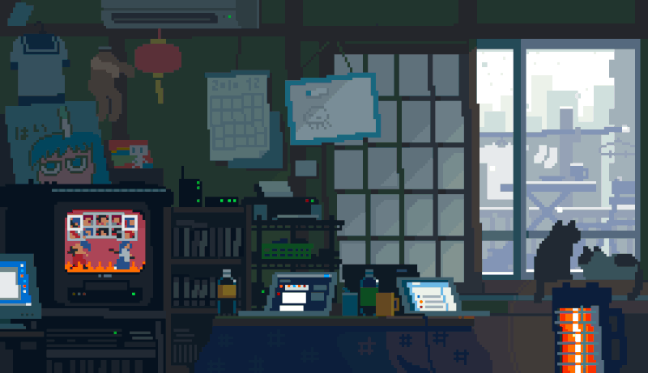

  

  
  

 

  

<h3 align="center">📝 About Me</h3>

  I'm a passionate <strong>Website Developer</strong> with solid experience in building dynamic, responsive, and scalable web applications. 
   
  I enjoy solving real-world problems through clean code, efficient databases, and intuitive user interfaces. 
   
  Currently, I'm focused on deepening my skills in full-stack JavaScript ecosystems and modern PHP frameworks, while always keeping best practices, security, and performance in mind. 
   
  Let's connect and build something impactful! 🚀

<h3 align="center">📊 GitHub Stats</h3>

  

 

<h3 align="center">🎮 Contribution Graph</h3>

  <picture>
    <source media="(prefers-color-scheme: dark)" srcset="https://raw.githubusercontent.com/alfathaannn/alfathaannn/output/pacman-contribution-graph-dark.svg">
    <source media="(prefers-color-scheme: light)" srcset="https://raw.githubusercontent.com/alfathaannn/alfathaannn/output/pacman-contribution-graph.svg">
    
  </picture>

 

  

 

  
  
  

 

  <b>alfathaannn</b> © 2026

